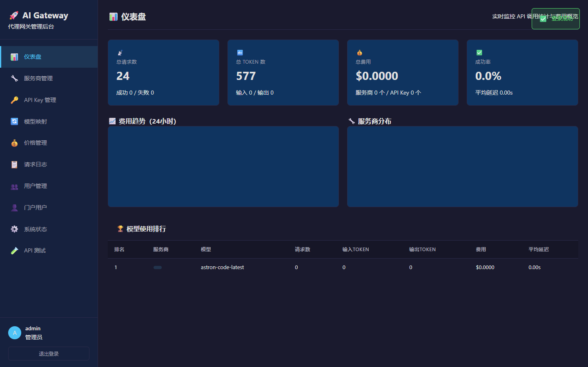
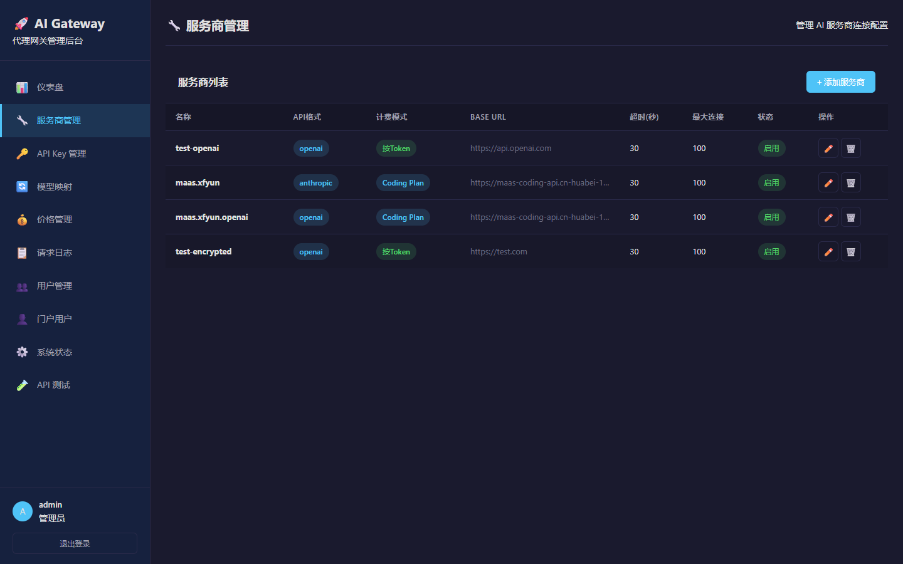
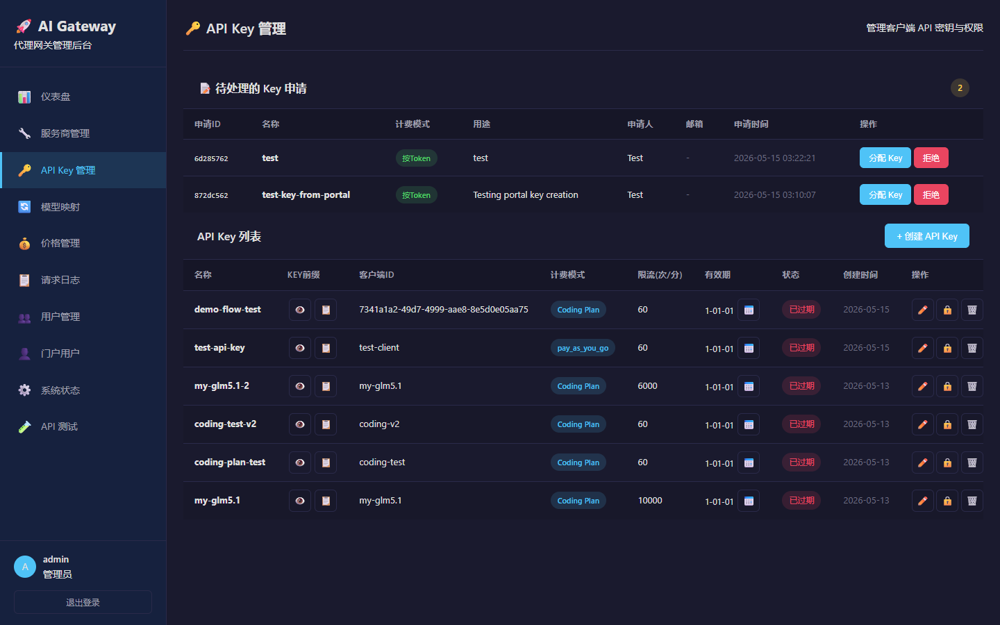
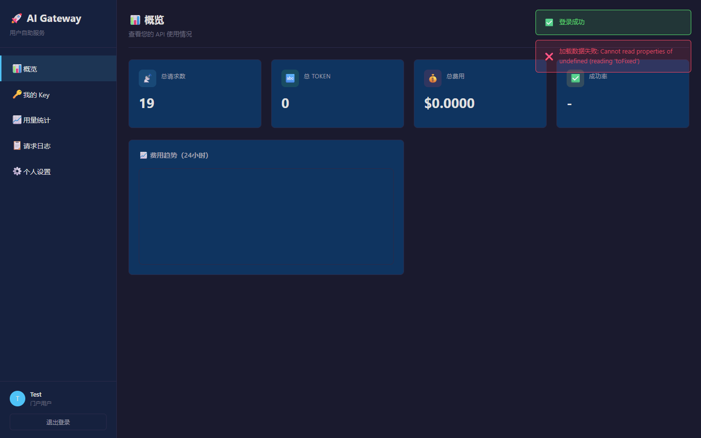

# DoraDoor

> 🚀 统一的 AI API 代理网关，支持多服务商接入、多协议兼容（OpenAI / Anthropic / Responses API）、API Key 管理、用量统计与计费、域名绑定与 HTTPS 自动证书管理

[](https://go.dev/)
[](LICENSE)

## 📋 目录

- [项目简介](#-项目简介)
- [核心功能](#-核心功能)
- [支持的客户端](#-支持的客户端)
- [系统架构](#-系统架构)
- [技术栈](#-技术栈)
- [界面预览](#-界面预览)
- [快速开始](#-快速开始)
- [配置说明](#-配置说明)
- [API 文档](#-api-文档)
- [部署指南](#-部署指南)
- [域名与 HTTPS](#-域名与-https)
- [安全特性](#-安全特性)
- [常见问题](#-常见问题)

---

## 📖 项目简介

DoraDoor 是一个高性能的 AI API 代理网关，旨在为企业和开发者提供统一的 AI 服务接入层。通过本系统，您可以：

- **统一接入**：通过一个 API 端点访问 OpenAI、Anthropic、DeepSeek、智谱 GLM、讯飞星火等多家 AI 服务商
- **多协议兼容**：同时支持 OpenAI Chat Completions、OpenAI Responses API、Anthropic Messages API 三种协议
- **格式自动转换**：Anthropic ↔ OpenAI 格式自动转换，无需客户端适配
- **灵活管理**：集中管理 API Key、模型映射、服务商配置
- **用量追踪**：实时监控 API 调用量、Token 消耗和费用
- **多租户**：支持管理后台和用户自助门户两种角色
- **安全部署**：一键绑定域名、自动申请 HTTPS 证书、自动续期

---

## ✨ 核心功能

### 🔧 服务商管理
- 支持多家 AI 服务商（OpenAI、Anthropic、DeepSeek、GLM、讯飞星火等）
- 自定义 Base URL，支持私有化部署和代理
- 支持 4 种 API 格式适配器：OpenAI、Anthropic、DeepSeek、GLM
- 服务商启用/禁用、优先级排序
- API Key 加密存储（AES-256-GCM）
- 连接池管理，支持 HTTP/2

### 🔑 API Key 管理
- 创建、编辑、启用/禁用、删除、批量删除 API Key
- 支持 4 种计费模式：按 Token 计费（per_token）、按请求计费（per_request）、包月套餐（quota）、编程套餐（coding_plan）
- 速率限制和月度配额控制
- API Key 过期时间设置
- Key 前缀掩码显示，保护密钥安全
- 配额手动重置

### � 编程套餐（Coding Plan）
- 5 小时 / 每周 / 每月 / 总计 四级使用次数限制
- Key 级别限制覆盖（取最大值，更宽松）
- 自动重置周期（5 小时 / 每周滚动窗口）
- 管理员可手动重置计数器

### �� 模型映射
- 自定义客户端模型名到实际服务商模型的映射
- 支持不同 API 格式之间的自动转换（Anthropic → OpenAI 格式）
- 支持客户端模拟模式（Hermes、OpenClaw 等），自动注入对应请求头
- 支持输出格式配置（openai / anthropic）
- 每条映射可独立设置 api_format

### 🔄 多协议支持
- **OpenAI Chat Completions API**：`POST /v1/chat/completions`
- **OpenAI Responses API**：`POST /v1/responses`（支持 Codex 等 CLI 工具）
- **Anthropic Messages API**：`POST /anthropic/v1/messages`（支持 Claude Code 等 CLI 工具）
- 自动格式转换：Anthropic 格式请求自动转换为 OpenAI 格式，响应自动转换回 Anthropic 格式
- 兼容 Claude Code v154+ 的 system role 变更（system 字段在 messages 数组中）

### 🔄 Anthropic ↔ OpenAI 格式转换
- **请求转换**：
  - `system` 顶级字段 / 数组 → OpenAI `system` role message
  - `messages` 中的 `role="system"` → OpenAI `system` role message（兼容 Claude Code v154+）
  - Anthropic tools（`name`, `description`, `input_schema`）→ OpenAI tools（`type:"function"`, `parameters`）
  - `tool_use` content blocks → `tool_calls`
  - `tool_result` content blocks → `tool` role messages
- **响应转换**（由 Anthropic 适配器处理）：
  - `system` role messages → 顶级 `system` 字段
  - `tool_calls` → `tool_use` content blocks
  - `tool` role messages → `tool_result` content blocks

### � Responses API 流式处理
- 完整的 SSE 事件序列：`response.created` → `output_item.added` → `content_part.added` → `content_part.text.delta` → `content_part.done` → `output_item.done` → `response.completed`
- 严格递增的 `sequence_number`
- Tool calls 支持：`function_call` 输出项 + `call_id` 映射
- `function_call` / `function_call_output` 输入项转换
- 上游 tool_call 按 index 追踪（无 id 场景）
- 客户端断连检测

### �� 定价管理
- 按服务商和模型配置输入/输出 Token 单价
- 支持多币种（USD、CNY），自动汇率转换
- 自动费用计算和统计
- 参考定价一键抓取（国际 / 国内）
- 批量设置定价

### 📊 仪表盘与统计
- 实时 API 调用统计（请求数、Token 数、费用、成功率）
- 24 小时费用趋势图表
- 服务商请求分布图
- 模型使用排行
- 系统状态监控
- 详细的请求日志查询（支持请求体 / 响应体记录）
- 用量分析（按服务商、模型、客户端维度）

### 👤 用户自助门户
- 门户用户自主注册和登录
- 邀请码注册（支持邀请模板 + 批量生成邀请码）
- 在线申请 API Key（审批制）
- 查看个人用量统计和费用趋势
- 修改个人资料和密码
- API Key 明文查看（创建后仅显示一次）

### 🎫 邀请码系统
- 邀请模板管理（可配置默认模型、计费模式、配额等）
- 批量生成邀请码
- 邀请码注册绑定 API Key
- 邀请码状态管理（启用/禁用/删除）

### 📝 审计与日志
- 管理员操作审计日志
- API 请求日志（含请求体 / 响应体，可配置开关）
- 日志按日期范围清理
- Key 申请审批流程

### 🌐 域名与 HTTPS
- 交互式配置域名绑定
- 自动申请 Let's Encrypt 免费 HTTPS 证书
- Certbot 容器自动续期（每 12 小时检查）
- Nginx 反向代理自动配置
- HTTP 自动重定向到 HTTPS
- TLS 1.2/1.3 安全配置

### 🔐 安全特性
- JWT Token 认证
- API Key 四级缓存（布隆过滤器 → 进程缓存 → Redis → 数据库）
- 滑动窗口速率限制
- SQL 注入防护（全参数化查询）
- API Key 加密存储
- 流式响应超时保护

---

## 🖥 支持的客户端

| 客户端 | 协议 | 端点 | 说明 |
|--------|------|------|------|
| OpenAI SDK | Chat Completions | `/v1/chat/completions` | 直接替换 base_url 即可 |
| Codex (OpenAI CLI) | Responses API | `/v1/responses` | 流式 SSE，支持 tool calls |
| Claude Code | Anthropic Messages | `/anthropic/v1/messages` | 自动格式转换，兼容 v154+ |
| Cursor | Chat Completions | `/v1/chat/completions` | 通过 client_simulation 模拟 |
| OpenClaw | Chat Completions | `/v1/chat/completions` | 自动注入 OpenClaw 请求头 |
| 任意 OpenAI 兼容客户端 | Chat Completions | `/v1/chat/completions` | 标准 OpenAI 格式 |

---

## 🏗 系统架构

```
┌──────────────┐     ┌──────────────────────────────────────────────────────────────┐     ┌─────────────────┐
│              │     │                    Nginx 反向代理                             │     │                 │
│   客户端     │────▶│  ┌─────────────────┐  ┌──────────────────────────────────┐   │────▶│   OpenAI API    │
│  (浏览器/    │     │  │  HTTP → HTTPS   │  │           DoraDoor               │   │     │                 │
│   CLI 工具)  │     │  │  自动重定向      │  │  ┌─────────┐  ┌──────────────┐  │   │     ├─────────────────┤
│              │     │  │  SSL 终止       │  │  │ 认证检查 │─▶│  模型映射     │  │   │     │  Anthropic API  │
│  Codex       │     │  │  安全头注入      │  │  │ (4级缓存)│  │ (路由)       │  │   │     │                 │
│  Claude Code │     │  └─────────────────┘  │  └─────────┘  └──────┬───────┘  │   │     ├─────────────────┤
│  OpenAI SDK  │     │                       │  ┌─────────┐  ┌──────▼───────┐  │   │     │  DeepSeek API   │
│              │     │  ┌─────────────────┐  │  │ 速率限制 │  │  适配器层     │  │   │     │                 │
│              │     │  │  Certbot        │  │  │ (滑动窗口)│  │ (格式转换)   │  │   │     ├─────────────────┤
│              │     │  │  自动证书续期    │  │  └─────────┘  │ openai       │  │   │     │  GLM API        │
│              │     │  │  (每12h检查)    │  │  ┌─────────┐  │ anthropic    │  │   │     │                 │
│              │     │  └─────────────────┘  │  │ 流式处理 │  │ deepseek     │  │   │     ├─────────────────┤
│              │     │                       │  │ (SSE)   │  │ glm          │  │   │     │  讯飞星火 API    │
│              │     │                       │  └─────────┘  └──────────────┘  │   │     │                 │
└──────────────┘     │                       └──────────────────────────────────┘   │     └─────────────────┘
                     │                                                              │
                     │  ┌──────────┐  ┌──────────┐  ┌──────────────┐                │
                     │  │PostgreSQL│  │  Redis   │  │ Prometheus   │                │
                     │  │ (数据存储)│  │ (缓存)   │  │ + Grafana    │                │
                     │  └──────────┘  └──────────┘  │ (监控可视化)  │                │
                     │                               └──────────────┘                │
                     └──────────────────────────────────────────────────────────────┘
```

### 请求处理流程

```
客户端请求 → Nginx SSL终止 → JWT/API Key 认证 → 速率限制检查 → 模型映射路由
    → 适配器格式转换 → 连接池获取连接 → 上游AI服务商
    → 适配器响应转换 → 统计记录 → Nginx → 返回客户端
```

### 多协议路由

```
/v1/chat/completions    → handleChatCompletions   (OpenAI Chat 格式)
/v1/responses           → handleResponses         (OpenAI Responses 格式 → 内部转为 Chat 格式)
/anthropic/v1/messages  → handleAnthropicEndpoint (Anthropic 格式 → 转为 OpenAI Chat 格式 → handleChatCompletions)
```

### HTTPS 证书管理流程

```
部署脚本交互配置 → 生成 Nginx 配置 → 启动 Nginx (HTTP)
    → Certbot 申请证书 (webroot/standalone) → 获取 SSL 证书
    → 重载 Nginx (启用 HTTPS) → Certbot 容器定时续期 (每12h)
```

---

## 💻 技术栈

| 组件 | 技术 | 说明 |
|------|------|------|
| 后端 | Go 1.22+ | 高性能 HTTP 服务器 |
| HTTP 框架 | fasthttp | 高吞吐量，低内存占用 |
| 数据库 | PostgreSQL 16+ | 结构化数据存储 |
| 缓存 | Redis 7+ | 多级缓存、速率限制 |
| 反向代理 | Nginx | SSL 终止、安全头、负载均衡 |
| HTTPS 证书 | Let's Encrypt + Certbot | 免费证书、自动申请与续期 |
| 监控 | Prometheus + Grafana | 指标采集和可视化 |
| 前端 | 原生 HTML/CSS/JS | 暗色主题管理后台和门户 |
| 部署 | Docker + systemd | 容器化和二进制两种部署方式 |

---

## 📸 界面预览

### 管理后台 - 仪表盘

实时监控 API 调用统计与费用概览，包含 KPI 卡片、费用趋势图表、服务商分布和模型使用排行。



### 管理后台 - 服务商管理

集中管理所有 AI 服务商的连接配置，支持多种 API 格式和计费模式。



### 管理后台 - API Key 管理

管理 API Key 的全生命周期，包括创建、分配、限速和计费模式配置。



### 用户自助门户

终端用户自主查看用量统计、管理 API Key、申请密钥。



---

## 🚀 快速开始

### 方式一：Docker Compose 部署（推荐）

```bash
# 1. 上传部署包到服务器
scp -r doradoor-docker/ user@server:/opt/

# 2. 进入目录并执行一键部署
cd /opt/doradoor-docker
sudo bash deploy.sh
```

部署脚本将以交互式方式引导您完成配置：

```
╔══════════════════════════════════════════════════╗
║     DoraDoor 一键部署脚本 v1.1.0              ║
║     支持域名绑定、HTTPS 自动证书管理              ║
╚══════════════════════════════════════════════════╝

══════════════════════════════════════════════════
  步骤 1/6: 域名和 HTTPS 配置
══════════════════════════════════════════════════

请配置域名和 HTTPS（直接回车使用默认值）

绑定域名: ai.example.com
  ✓ 域名设置为: ai.example.com
是否启用 HTTPS [Y/n]: Y
  ✓ HTTPS 已启用
是否自动更新 HTTPS 证书 [Y/n]: Y
  ✓ 证书自动续期已启用
  ✓ 配置已保存
```

脚本会自动完成：
- ✅ 检查并安装 Docker 和 Docker Compose
- ✅ 创建 `.env` 环境变量文件（自动生成 JWT 密钥）
- ✅ 生成 Nginx 反向代理配置
- ✅ 配置 HTTPS 证书自动申请与续期
- ✅ 构建镜像并启动所有服务
- ✅ 申请 Let's Encrypt SSL 证书

### 方式二：二进制部署

```bash
# 1. 上传对应架构的部署包
scp -r doradoor-linux-amd64/ user@server:/opt/

# 2. 执行一键部署
cd /opt/doradoor-linux-amd64
sudo bash deploy-binary.sh
```

部署脚本会自动：
- 检查并安装 PostgreSQL 和 Redis
- 创建数据库
- 配置 systemd 系统服务
- 启动网关服务

### 首次登录

部署完成后访问：

| 页面 | 地址 | 默认账号 |
|------|------|----------|
| 管理后台 | `http://your-server:3001/admin/` | admin / admin123 |
| 用户门户 | `http://your-server:3001/portal/` | 自行注册 |
| 健康检查 | `http://your-server:3001/health` | - |
| Prometheus | `http://your-server:9090/` | - |
| Grafana | `http://your-server:3002/` | admin / admin |

> ⚠️ **生产环境请务必修改默认密码和 JWT 密钥！**

---

## ⚙️ 配置说明

### 环境变量（.env）

| 变量 | 说明 | 默认值 |
|------|------|--------|
| `OPENAI_API_KEY` | OpenAI API 密钥 | - |
| `ANTHROPIC_API_KEY` | Anthropic API 密钥 | - |
| `DEEPSEEK_API_KEY` | DeepSeek API 密钥 | - |
| `GLM_API_KEY` | 智谱 GLM API 密钥 | - |
| `ADMIN_PASSWORD` | 管理员密码 | admin123 |
| `JWT_SECRET` | JWT 签名密钥 | - |
| `POSTGRES_PASSWORD` | PostgreSQL 密码 | password |
| `ENCRYPTION_KEY` | API Key 加密密钥（32字节） | - |

### 主配置文件（config.yaml）

```yaml
server:
  port: 3001                    # 服务端口
  max_request_size: 10485760    # 最大请求体 10MB
  concurrency: 10000            # 最大并发数

# 流式响应配置
stream:
  read_timeout: 180s            # 流式读取超时（支持AI深度思考）
  response_timeout: 120s        # 等待首个响应超时
  enable_client_timeout: false  # 是否限制流式请求总时长

# 安全配置
security:
  encryption_key: "${ENCRYPTION_KEY}"  # API Key加密密钥

# 数据库
database:
  host: "localhost"
  port: 5432
  dbname: "ai_gateway"

# Redis
redis:
  addr: "localhost:6379"

# 日志配置
logging:
  log_request_body: true        # 记录请求体
  log_response_body: true       # 记录响应体
```

### 部署配置（.deploy-config）

交互式部署脚本会自动保存配置到 `.deploy-config` 文件，下次部署时自动加载：

```bash
DOMAIN="ai.example.com"
ENABLE_HTTPS="yes"
ENABLE_HTTPS_AUTO_RENEW="yes"
```

---

## 📡 API 文档

### OpenAI 兼容接口

本网关完全兼容 OpenAI API 格式，可直接替换 OpenAI SDK 的 Base URL。

```python
from openai import OpenAI

client = OpenAI(
    api_key="your-gateway-api-key",
    base_url="http://your-server:3001/v1"
)

# 非流式请求
response = client.chat.completions.create(
    model="my-gpt4",  # 使用映射后的模型名
    messages=[{"role": "user", "content": "Hello!"}]
)

# 流式请求
stream = client.chat.completions.create(
    model="my-gpt4",
    messages=[{"role": "user", "content": "Hello!"}],
    stream=True
)
for chunk in stream:
    print(chunk.choices[0].delta.content, end="")
```

### Anthropic 兼容接口

支持 Claude Code 等 Anthropic 格式客户端，自动转换为 OpenAI 格式并转发。

```bash
# Claude Code 配置
export ANTHROPIC_BASE_URL=http://your-server:3001/anthropic
export ANTHROPIC_API_KEY=your-gateway-api-key
```

网关自动处理：
- Anthropic `system` 字段 / 数组 → OpenAI `system` role message
- Anthropic `tool_use` / `tool_result` → OpenAI `tool_calls` / `tool` message
- 响应自动转换回 Anthropic 格式

### Responses API 接口

支持 Codex 等 OpenAI Responses API 客户端。

```bash
# Codex 配置
export OPENAI_BASE_URL=http://your-server:3001/v1
export OPENAI_API_KEY=your-gateway-api-key
```

### 代理端点一览

| 端点 | 协议 | 说明 |
|------|------|------|
| `POST /v1/chat/completions` | OpenAI Chat | 标准 Chat Completions |
| `POST /v1/responses` | OpenAI Responses | Responses API（Codex） |
| `POST /anthropic/v1/messages` | Anthropic Messages | Anthropic 格式（Claude Code） |
| `GET /v1/models` | OpenAI | 模型列表 |

### 管理 API

| 方法 | 路径 | 说明 |
|------|------|------|
| POST | `/api/auth/login` | 管理员登录 |
| POST | `/api/auth/change-password` | 修改密码 |
| GET | `/api/admin/providers` | 服务商列表 |
| POST | `/api/admin/providers` | 创建服务商 |
| PUT | `/api/admin/providers/{name}` | 更新服务商 |
| DELETE | `/api/admin/providers/{name}` | 删除服务商 |
| GET | `/api/admin/api-keys` | API Key 列表 |
| POST | `/api/admin/api-keys` | 创建 API Key |
| PUT | `/api/admin/api-keys/{id}` | 更新 API Key |
| DELETE | `/api/admin/api-keys/{id}` | 删除 API Key |
| POST | `/api/admin/api-keys/batch-delete` | 批量删除 API Key |
| POST | `/api/admin/api-keys/{id}/reset-quota` | 重置配额 |
| GET | `/api/admin/model-routes` | 模型映射列表 |
| POST | `/api/admin/model-routes` | 创建模型映射 |
| PUT | `/api/admin/model-routes/{clientModel}` | 更新模型映射 |
| DELETE | `/api/admin/model-routes/{clientModel}` | 删除模型映射 |
| GET | `/api/admin/pricing` | 定价列表 |
| POST | `/api/admin/pricing` | 创建定价 |
| POST | `/api/admin/pricing/batch` | 批量设置定价 |
| GET | `/api/admin/reference-pricing` | 参考定价 |
| POST | `/api/admin/reference-pricing/fetch` | 抓取参考定价 |
| GET | `/api/admin/exchange-rate` | 汇率查询 |
| POST | `/api/admin/test-chat` | 测试聊天 |
| GET | `/api/admin/usage-analysis` | 用量分析 |
| GET | `/api/logs/recent` | 请求日志 |
| GET | `/api/logs/{id}` | 日志详情 |
| GET | `/api/admin/audit-logs` | 审计日志 |
| POST | `/api/admin/audit-logs/delete-by-date` | 按日期清理审计日志 |
| POST | `/api/admin/logs/clear` | 清理请求日志 |
| DELETE | `/api/admin/logs/{id}` | 删除单条日志 |
| POST | `/api/admin/logs/delete-by-date` | 按日期清理请求日志 |
| GET | `/api/admin/users` | 管理员用户列表 |
| GET | `/api/admin/key-requests` | Key 申请列表 |
| POST | `/api/admin/key-requests/{id}/approve` | 审批 Key 申请 |
| PUT | `/api/admin/key-requests/{id}/reject` | 拒绝 Key 申请 |
| GET | `/api/admin/invite-templates` | 邀请模板列表 |
| POST | `/api/admin/invite-templates` | 创建邀请模板 |
| GET | `/api/admin/invite-codes` | 邀请码列表 |
| POST | `/api/admin/invite-codes/generate` | 批量生成邀请码 |
| GET | `/api/dashboard/summary` | 仪表盘概览 |
| GET | `/api/dashboard/cost-chart` | 费用趋势 |
| GET | `/api/dashboard/provider-chart` | 服务商分布 |
| GET | `/api/dashboard/model-ranking` | 模型排行 |
| GET | `/api/dashboard/system-status` | 系统状态 |
| GET | `/api/stats/overview` | 统计概览 |

### 门户 API

| 方法 | 路径 | 说明 |
|------|------|------|
| POST | `/api/portal/auth/login` | 门户登录 |
| POST | `/api/portal/register` | 门户注册 |
| POST | `/api/portal/register-invite` | 邀请码注册 |
| GET | `/api/portal/verify-invite` | 验证邀请码 |
| GET | `/api/portal/api-keys` | 我的 API Key |
| POST | `/api/portal/api-keys` | 申请 API Key |
| DELETE | `/api/portal/api-keys/{id}` | 删除 API Key |
| PUT | `/api/portal/api-keys/{id}/toggle` | 启用/禁用 API Key |
| GET | `/api/portal/api-keys/{id}/plaintext` | 获取 Key 明文 |
| GET | `/api/portal/models` | 可用模型列表 |
| GET | `/api/portal/stats/overview` | 用量概览 |
| GET | `/api/portal/stats/by-model` | 按模型统计 |
| GET | `/api/portal/stats/by-key` | 按 Key 统计 |
| GET | `/api/portal/stats/cost-trend` | 费用趋势 |
| GET | `/api/portal/logs` | 请求日志 |
| GET | `/api/portal/logs/{id}` | 日志详情 |
| GET | `/api/portal/profile` | 个人资料 |
| PUT | `/api/portal/auth/profile` | 更新资料 |
| PUT | `/api/portal/auth/password` | 修改密码 |

---

## 📦 部署指南

### 系统要求

| 项目 | 最低要求 |
|------|----------|
| 操作系统 | Linux (amd64/arm64) |
| 内存 | 1GB+ |
| 磁盘 | 500MB+ |
| Docker 部署 | Docker 20+ / Docker Compose V2 |
| 二进制部署 | PostgreSQL 16+ / Redis 7+ |
| HTTPS 证书 | 域名已解析到服务器 + 80/443 端口可公网访问 |

### Docker Compose 部署

```bash
# 克隆项目
git clone <repository-url>
cd doradoor

# 编辑环境变量
cp .env.example .env
nano .env  # 填写 API Key 和密码

# 一键部署（交互式配置域名和 HTTPS）
sudo bash deploy.sh
```

### 宝塔面板部署（推荐腾讯云/阿里云用户）

适用于已安装宝塔面板的服务器，AI Gateway 用 Docker 运行，Nginx/SSL 由宝塔面板管理。

```bash
# 上传项目到服务器
cd doradoor

# 一键部署（自动检测宝塔环境）
sudo bash deploy-bt.sh
```

交互式配置流程：

```
步骤 2/7: 域名和 HTTPS 配置

绑定域名: ai.example.com
是否启用 HTTPS [Y/n]: Y
请选择 SSL 证书管理方式:
  1) 宝塔面板管理（推荐）— 在宝塔面板中一键申请/续签
  2) Certbot 自动管理 — 脚本自动申请 Let's Encrypt 证书
请选择 [1/2]: 1
```

**Nginx 版本选择**：推荐选择 **Nginx 1.28**（标准版），本项目只需反向代理 + SSL 终止，不需要 OpenResty 的 Lua 能力。

#### 宝塔面板网站配置完整步骤

部署脚本执行完成后，还需要在宝塔面板中完成以下配置：

##### 第一步：创建网站

1. 登录宝塔面板（默认地址 `http://服务器IP:8888`）
2. 点击左侧菜单 **[网站]** → 点击 **[添加站点]**
3. 填写配置：
   - **域名**：填写您的域名（如 `ai.example.com`）
   - **网站类型**：选择 **反向代理**
   - **目标URL**：`http://127.0.0.1:3001`
   - **发送域名**：`$host`
4. 点击 **[提交]** 创建网站

> 💡 如果宝塔版本没有"反向代理"网站类型选项，则选择"纯静态"创建网站，然后在第二步中手动配置反向代理。

##### 第二步：修改反向代理配置（支持 SSE 长连接）

宝塔创建反向代理站点后，默认的代理配置不支持 AI 流式对话（SSE 长连接），需要手动修改。

1. 点击左侧菜单 **[网站]** → 找到刚创建的站点 → 点击 **[设置]**
2. 点击左侧 **[反向代理]** → 点击已创建的代理名称 **[ai-gateway]**
3. 点击 **[配置文件]**，将 `location / { }` 部分**替换为以下内容**：

```nginx
location / {
    proxy_pass http://127.0.0.1:3001;
    proxy_http_version 1.1;

    # WebSocket / SSE 支持
    proxy_set_header Upgrade $http_upgrade;
    proxy_set_header Connection "upgrade";

    # 透传真实 IP
    proxy_set_header Host $host;
    proxy_set_header X-Real-IP $remote_addr;
    proxy_set_header X-Forwarded-For $proxy_add_x_forwarded_for;
    proxy_set_header X-Forwarded-Proto $scheme;

    # SSE 长连接超时（24小时，支持 AI 深度思考）
    proxy_read_timeout 86400s;
    proxy_send_timeout 86400s;

    # 缓冲关闭（流式响应必须）
    proxy_buffering off;
    proxy_cache off;

    # 大请求体支持
    client_max_body_size 10m;
}
```

4. 点击 **[保存]**

> 💡 部署脚本会自动生成此配置片段到 `nginx-proxy-snippet.conf` 文件，可直接复制使用。

##### 第三步：申请 SSL 证书（如需 HTTPS）

1. 点击左侧菜单 **[网站]** → 找到站点 → 点击 **[设置]**
2. 点击左侧 **[SSL]** → 选择 **[Let's Encrypt]**
3. 勾选域名 → 填写邮箱 → 点击 **[申请]**
4. 申请成功后，开启 **[强制HTTPS]**

> 💡 **自动续签**：宝塔面板的 Let's Encrypt 证书**默认自动续签**，无需额外配置。证书有效期 90 天，宝塔会在到期前自动续签。
>
> ⚠️ **续签失败常见原因**：
> - 站点开启了 CDN（如 Cloudflare），导致验证失败
> - 站点开启了 301 重定向
> - 80 端口不可公网访问
> - 如使用 CDN，需改用 **DNS 验证**方式（在 SSL 页面选择 DNS 验证，并配置云服务商 API Key）

> ⚠️ **重要**：开启强制 HTTPS 后，宝塔会修改 Nginx 配置添加 301 重定向。请再次检查配置文件中的反向代理 `location / { }` 是否还在，如果被覆盖请重新按第二步配置。

##### 第四步：放行防火墙端口

1. 点击左侧菜单 **[安全]** → **[防火墙]**
2. 放行以下端口：
   - **80** — HTTP（必须，SSL 证书申请也需要）
   - **443** — HTTPS（如启用 SSL）
3. 如果使用腾讯云/阿里云，还需要在**云控制台的安全组**中放行相同端口

##### 验证部署

```bash
# 检查 Docker 服务状态
docker ps

# 检查 AI Gateway 健康状态
curl http://127.0.0.1:3001/health

# 检查 Nginx 配置是否正确
/www/server/nginx/sbin/nginx -t

# 测试通过域名访问
curl -I https://ai.example.com/health
```

访问 `https://ai.example.com/admin/` 即可进入管理后台。

##### 常见问题排查

**问题：登录成功但各种功能显示"服务不可用"**

这通常是 Nginx 反向代理配置问题，API 请求没有正确转发到后端。排查步骤：

1. **检查后端服务是否正常运行**：
   ```bash
   # 查看容器状态
   docker ps | grep ai-gateway
   
   # 查看服务日志
   docker logs doradoor --tail 50
   
   # 直接测试后端 API（绕过 Nginx）
   curl http://127.0.0.1:3001/health
   curl -X POST http://127.0.0.1:3001/api/auth/login \
     -H "Content-Type: application/json" \
     -d '{"username":"admin","password":"admin123"}'
   ```

2. **检查 Nginx 反向代理配置**：
   ```bash
   # 查看站点配置文件
   cat /www/server/panel/vhost/nginx/ai.example.com.conf
   ```
   
   确保 `location / { }` 中包含以下关键配置：
   - `proxy_pass http://127.0.0.1:3001;`（不带尾部斜杠）
   - `proxy_http_version 1.1;`
   - `proxy_set_header Host $host;`
   - `proxy_buffering off;`（流式响应必须关闭缓冲）

3. **检查宝塔反向代理是否覆盖了配置**：
   
   宝塔面板创建反向代理网站时，会自动生成一个 `location / { }` 配置块。如果你在宝塔面板的"反向代理"设置页面修改了配置，**请确保修改的是配置文件而不是面板界面**，因为面板界面修改可能会覆盖你的自定义配置。
   
   正确做法：**网站 → 设置 → 配置文件**（直接编辑 Nginx 配置文件），而不是通过"反向代理"界面修改。

4. **检查 SSL 配置是否覆盖了反向代理**：
   
   开启强制 HTTPS 后，宝塔会添加 301 重定向的 `server` 块。请检查 HTTPS 的 `server` 块中是否也包含了反向代理的 `location / { }` 配置。

5. **检查防火墙/安全组**：
   ```bash
   # 检查宝塔防火墙
   cat /www/server/panel/data/port.pl
   
   # 检查系统防火墙
   iptables -L -n | grep -E "3001|80|443"
   ```

### 二进制部署

```bash
# 上传部署包后
cd doradoor-linux-amd64

# 编辑环境变量
nano .env

# 一键部署
sudo bash deploy-binary.sh

# 管理服务
systemctl status ai-gateway    # 查看状态
systemctl restart ai-gateway   # 重启
journalctl -u ai-gateway -f    # 查看日志
```

### 打包部署包（开发环境）

在项目根目录执行：

```powershell
# Windows 打包
powershell -ExecutionPolicy Bypass -File build-dist.ps1
```

生成的部署包位于 `dist/` 目录：
- `doradoor-docker/` — Docker Compose 部署包
- `doradoor-linux-amd64/` — Linux x86_64 二进制部署包
- `doradoor-linux-arm64/` — Linux ARM64 二进制部署包

---

## 🌐 域名与 HTTPS

### 交互式配置

部署脚本 `deploy.sh` 支持交互式配置域名和 HTTPS，流程如下：

```
步骤 1/6: 域名和 HTTPS 配置

绑定域名 [ai.example.com]: ← 输入您的域名
是否启用 HTTPS [Y/n]: ← 选择是否启用 HTTPS
是否自动更新 HTTPS 证书 [Y/n]: ← 选择是否自动续期
```

### 三种访问模式

| 模式 | 配置 | 访问方式 |
|------|------|----------|
| IP 直连 | 不设置域名 | `http://IP:3001/` |
| 域名 + HTTP | 设置域名，不启用 HTTPS | `http://domain/` |
| 域名 + HTTPS | 设置域名，启用 HTTPS | `https://domain/` |

### HTTPS 证书管理

部署脚本使用 [Let's Encrypt](https://letsencrypt.org/) 提供免费 SSL 证书，通过 [Certbot](https://certbot.eff.org/) 自动管理：

#### 自动申请

部署时脚本会自动：
1. 启动 Nginx 容器（先以 HTTP 模式运行）
2. 使用 Certbot 申请 SSL 证书（优先 webroot 方式，失败则回退 standalone 方式）
3. 重载 Nginx 启用 HTTPS

#### 自动续期

启用自动续期后，Certbot 容器会每 12 小时检查证书到期情况，在证书到期前自动续期。

#### 手动管理

```bash
# 手动续期证书
docker compose run --rm certbot renew

# 查看证书信息
docker compose run --rm certbot certificates

# 重新申请证书
docker compose run --rm certbot certonly --webroot -w /var/www/certbot -d your-domain.com

# 重载 Nginx 配置
docker compose exec nginx nginx -s reload
```

### Nginx 配置

部署脚本会根据配置自动生成 Nginx 配置文件 `nginx/conf.d/default.conf`：

**HTTPS 模式**包含：
- HTTP → HTTPS 301 重定向
- TLS 1.2 / 1.3 协议
- 现代 SSL 密码套件
- 安全响应头（X-Frame-Options、X-Content-Type-Options、X-XSS-Protection）
- WebSocket 升级支持
- SSE 长连接支持（`proxy_read_timeout 86400`）
- Certbot ACME 验证路径

### Docker Compose 服务组件

启用域名绑定后，`docker-compose.override.yml` 会自动添加以下服务：

| 服务 | 镜像 | 说明 |
|------|------|------|
| nginx | nginx:alpine | 反向代理、SSL 终止 |
| certbot | certbot/certbot | 证书申请与自动续期 |

### 配置持久化

部署配置保存在 `.deploy-config` 文件中，再次运行部署脚本时会自动加载之前的配置作为默认值，方便升级和重新部署。

---

## 🔒 安全特性

| 特性 | 实现方式 |
|------|----------|
| 认证 | JWT Token + API Key 双重认证 |
| API Key 存储 | SHA-256 哈希 + AES-256-GCM 加密 |
| 认证性能 | 四级缓存：布隆过滤器 → 进程缓存 → Redis → 数据库 |
| 速率限制 | Redis 滑动窗口算法 |
| 编程套餐限速 | 5小时/每周/每月/总计 四级次数限制 |
| SQL 注入防护 | 全参数化查询 |
| 流式保护 | 可配置读取超时（默认180秒） |
| HTTP 安全头 | X-Content-Type-Options、X-Frame-Options、X-XSS-Protection |
| TLS | 上游连接强制 TLS 1.2+ |
| HTTPS | Let's Encrypt + Nginx SSL 终止 |
| 证书续期 | Certbot 容器自动续期（每12小时检查） |
| HTTP 重定向 | HTTP 请求自动 301 重定向到 HTTPS |
| 审计日志 | 管理员操作全程记录 |

---

## ❓ 常见问题

### Claude Code 报错 `400 messages[1].role must be either 'user' or 'assistant', but got 'system'`

Claude Code v154+ 将 system 消息放在 `messages` 数组中，部分上游不支持。解决方案：

1. **网关自动处理**（推荐）：本网关已内置兼容，自动将 `messages` 中的 `system` role 转换为正确格式
2. **客户端设置**：在 Claude Code 配置中添加环境变量 `CLAUDE_CODE_SIMPLE=1`，禁用自适应思考

### Codex 流式响应中断

如果 Codex 对话中途断开，可调整 `config.yaml` 中的超时配置：
```yaml
stream:
  read_timeout: 300s      # 增大读取超时
  response_timeout: 180s  # 增大首响应超时
```

### HTTPS 证书申请失败

**原因**：
1. 域名未解析到服务器 IP
2. 80 或 443 端口被防火墙拦截
3. 域名拼写错误

**解决**：
```bash
# 检查域名解析
dig your-domain.com

# 检查端口是否开放
curl -I http://your-domain.com

# 手动申请证书
docker compose run --rm certbot certonly --webroot -w /var/www/certbot -d your-domain.com
```

### 如何更换域名

重新运行部署脚本，输入新的域名即可：
```bash
sudo bash deploy.sh
# 输入新域名，脚本会自动重新生成配置
```

### 如何从 HTTP 升级到 HTTPS

重新运行部署脚本，在 HTTPS 选项中选择 `Y`：
```bash
sudo bash deploy.sh
# 域名保持不变，HTTPS 选择 Y
```

### 流式响应中断

如果 AI 对话中途断开，可调整 `config.yaml` 中的超时配置：
```yaml
stream:
  read_timeout: 300s      # 增大读取超时
  response_timeout: 180s  # 增大首响应超时
```

### 忘记管理员密码

修改 `.env` 文件中的 `ADMIN_PASSWORD`，然后重启服务：
```bash
# Docker 部署
docker compose restart ai-gateway

# 二进制部署
systemctl restart ai-gateway
```

---

## 📄 License

MIT License

---

## 🤝 贡献

欢迎提交 Issue 和 Pull Request。
